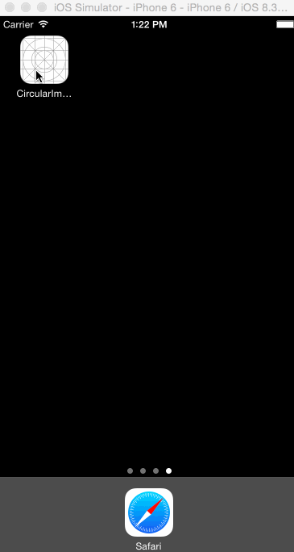

# CircularImageLoder
使用CAShapeLayer来实现圆形图片加载动画

原文使用swift。这里我用OC实现了一遍，并添加了详细的注释。

## 效果如下：

Ray Wenderlich原文链接 : [How To Implement A Circular Image Loader Animation with CAShapeLayer](http://www.raywenderlich.com/94302/implement-circular-image-loader-animation-cashapelayer)

原文作者 : [Rounak Jain](http://www.raywenderlich.com/u/rounak)

译文出自 : [开发技术前线 www.devtf.cn](http://www.devtf.cn/)

译者 : [Sam Lau](https://github.com/samlaudev)

译者简书:[Sam_Lau](http://www.jianshu.com/p/16ef46c14515)

校对者: Lollypo
